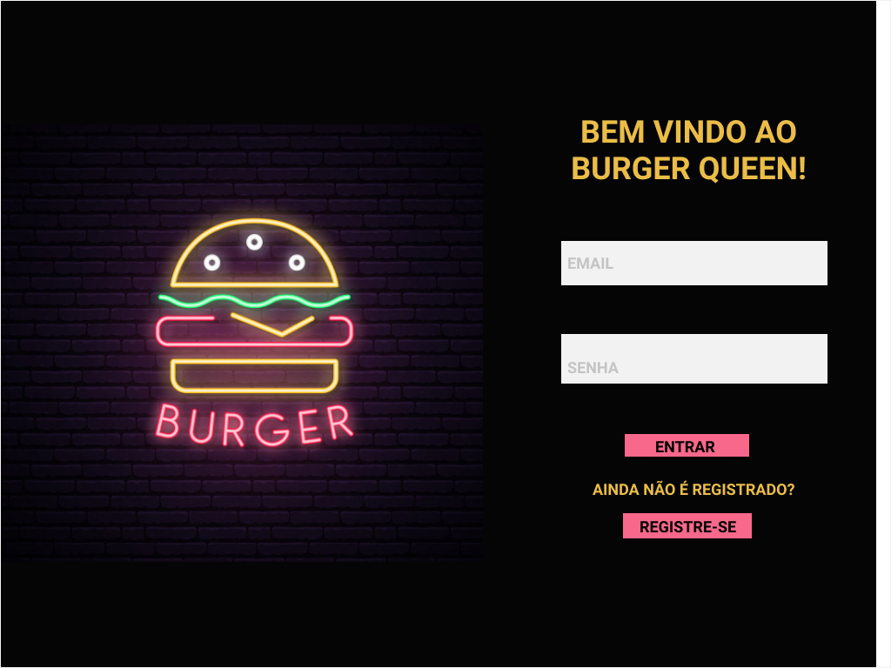
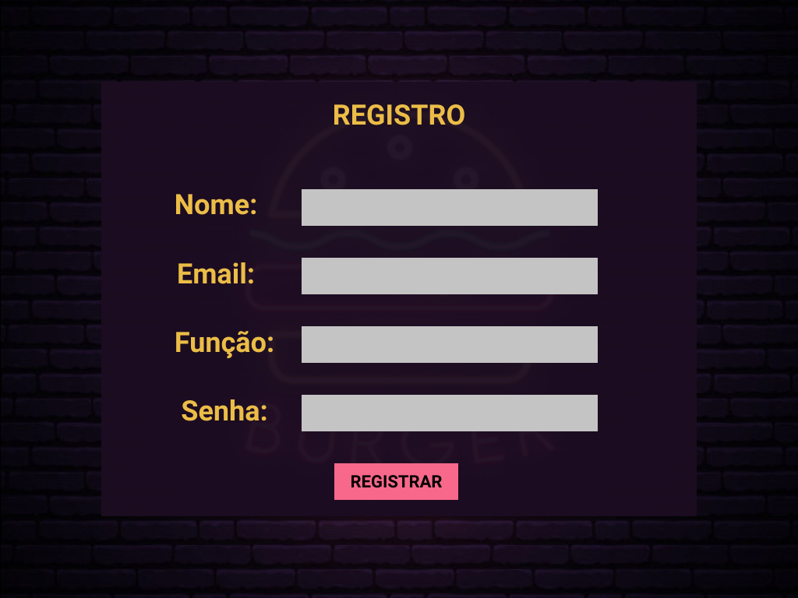
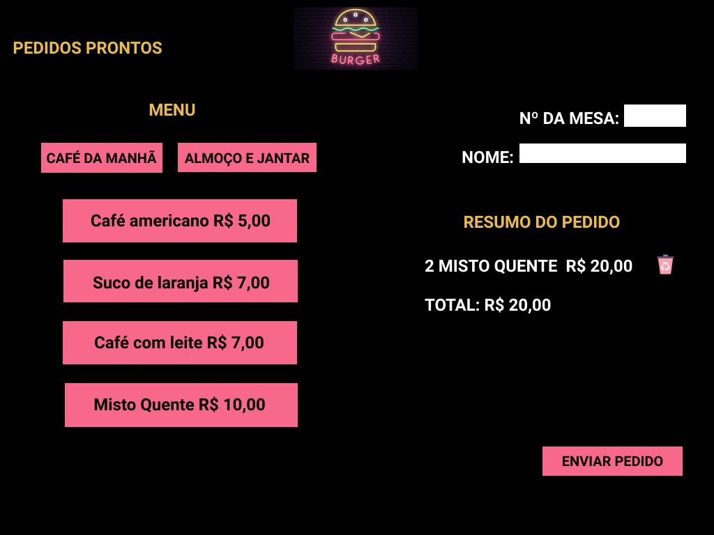
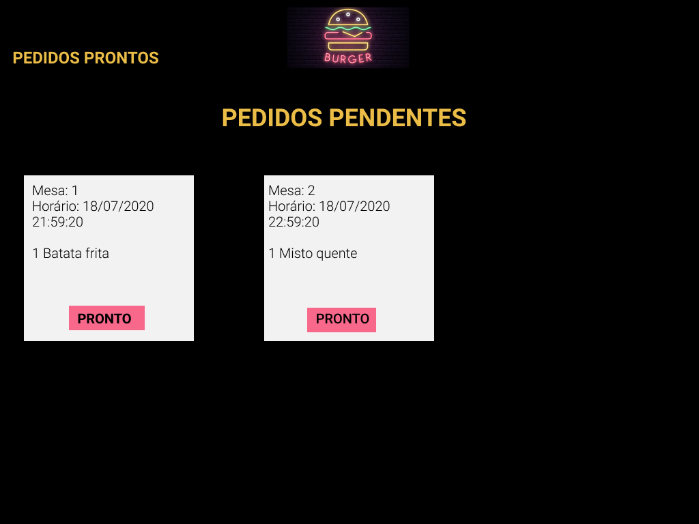

# Friends Burger


## 1. Definição do produto
Friends Burger é uma plataforma desenvolvida para uma pequena hamburgueria que está crescendo e necessita de uma interface em que se possa realizar pedidos utilizando um tablet, e enviá-los para a cozinha para que sejam preparados de forma ordenada e eficiente.

 [Clique aqui](https://burger-queen-sap004.web.app/) para acessar o Friends Burger.

## 2. Usuário

O Projeto foi pensado e desenvolvido para funcionários de um restaurante, como o funcionário que anota os pedidos dos clientes, e o funcionário que prepara os pedios. 

## 3. Funcionalidades
Para esse projeto, nos foi passado as Historias de Usuário abaixo, todas foram implementadas.
* História de usuário 1: Usuário deve ter seu perfil (login/senha) para acessar o sistema.
Critérios de aceitação: Criar login e senha;
Registar tipo de usuário (cozinha / salão), login e senha;
Entrar na tela correta para cada usuário.

* História de usuário 2: Garçom/Garçonete deve poder anotar o seu pedido. Critérios de aceitação: Anotar o nome e mesa;
Adicionar produtos aos pedidos; 
Excluir produtos; 
Ver resumo e o total da compra; 
Enviar o pedido para a cozinha (guardar em algum banco de dados).

* História de usuário 3: Chefe de cozinha deve ver os pedidos. Critérios de aceitação:
Ver os pedidos à medida em que são feitos;
Marcar os pedidos que foram preparados e estão prontos para serem servidos;
Ver o tempo que levou para preparar o pedido desde que chegou, até ser marcado como concluído.

* História de usuário 4: Garçom/Garçonete deve ver os pedidos prontos para servir. Critérios de aceitação: 
Ver a lista de pedidos prontos para servir;
Marque os pedidos que foram entregues.


## 4. Protótipo de baixa fidelidade 
  * Pagina de Login:

  

  * Pagina de Cadastro:

  

  * Pagina do salão:

  

  * Pagina da cozinha:

  


## 5. Testes de usabilidade
Durante o desenvolvimento do projeto, fizemos os testes de usabilidades com usuários, que nos retornaram feedbacks muito importantes para a melhoria do projeto, várias sugestões foram implementadas, possibilitando uma melhor experiência para o usuário.

## 6. Interface
A interface foi desenvolvida com design responsivo, simples e intuitivo, usando como  tema a série de TV "Friends".

## 7. Instalação

### Instalação

- Clone esse repositório na sua máquina executando o seguinte comando no seu terminal:

```sh
git clone (link-do-repositório)
```

- Instale as dependências do projeto com o comando:

```sh
npm install
```

- Execute o projeto na sua máquina com:

```sh
npm start
```
- Visualize o projeto no seu navegador com o link:

```sh
http://localhost:3000
```

## 8. Considerações técnicas

Ferramentas utilizadas no projeto:

* HTML, CSS, JavaScript, React.js, React Hooks,React Router, Node.js, Npm, Firebase, Material UI, Figma, Git e GitHub.

## 9. Implementações futuras

- Histórico de pedidos.
- Testes.

## Autoras

[Karine Sardela](https://github.com/kfsardela) e [Aline Rozetti ](https://github.com/alinerozetti).

Projeto desenvolvido para fins de aprendizado no Bootcamp da [Laboratória Brasil](https://www.laboratoria.la/br). 


